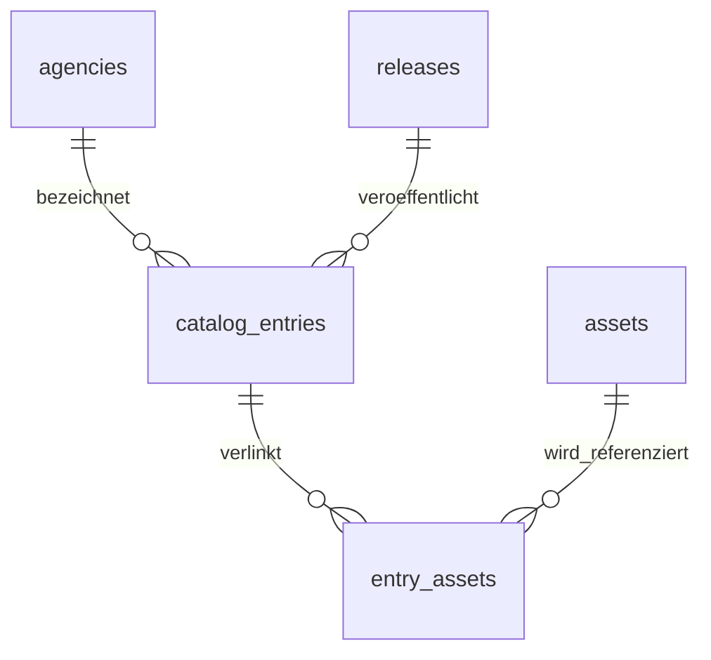

[Workshop-Übersicht](../../README.md) · [Technische Vorbereitung](../../README_technical_preparation.md) · [Microblogging-Beispiele](../../demos/microblogging/README.md) · [SQLite](README.md) · [MongoDB](../02_mongodb/README.md) · [Neo4j](../03_neo4j/README.md) · [TinyFlux](../04_tinyflux/README.md)

---

# Aufgabe 1: UFO-Akten in SQLite — Was zählen wir eigentlich?

Eine Forschungsredaktion möchte über die Western-USA-Akten berichten. Zwei Zeugen beschreiben ungewöhnliche Lichter und Objekte; eine weitere Akte analysiert einen Teil der Schilderungen. Du sollst die Quellen recherchierbar machen und belastbare Bestandszahlen liefern.

**Dein Ergebnis:** ein relationaler Katalog mit geprüften Schlüsselbeziehungen, eine Quellenübersicht, eine korrekt bezeichnete Bestandszählung und Deine fachliche Einordnung.

## Dateien und Einstieg

| Datei | Zweck |
| --- | --- |
| [task.ipynb](task.ipynb) | Dein Aufgaben-Notebook mit TODO-Zellen und eingebauten Kontrollen |
| [task_sample_solution.ipynb](task_sample_solution.ipynb) | Eigenständige, ausführbare Musterlösung |
| [WALKTHROUGH.md](WALKTHROUGH.md) | Ergebnisse, Begründungen und typische Fehler für die gemeinsame Besprechung |
| [Basisschema](../../schemas/sqlite/uap_base.sql) | Vorgegebene Stammtabellen und aufgelöste Portalverweise |
| [Datenwörterbuch](../../data/README.md) | Felder, Aufbereitung und Grenzen des Eingabebestands |
| [Aktenleseführer](../../docs/AKTENLESEFUEHRER.md) | Quellenart und konkrete PDF-Seiten |

Verwende die [Kursumgebung](../../README_technical_preparation.md) und den Kernel **Python (rothstein-storage-workshop-2026)**. Starte JupyterLab im Repository mit `jupyter lab` oder öffne das Notebook in VS Code. Führe die Zellen von oben nach unten aus. SQLite ist in Python enthalten; für diese Aufgabe ist kein laufender MongoDB-/Neo4j-Dienst und kein Docker nötig. Für den gesamten Storage-Block gelten weiterhin die drei beschriebenen Setup-Wege.

Der Einstieg verwendet die sechs CSV-Dateien aus `data/input/relational/`. Die Aufgabe benötigt weder die Microblogging-Demo noch ein Ergebnis einer anderen Gruppe. Die Original-PDFs sind enthalten; ein neuer Download ist nicht nötig.

## Lernziele

Nach dieser Aufgabe kannst Du:

- technische Primärschlüssel von nicht eindeutigen Quellbezeichnungen unterscheiden;
- eine n:m-Beziehung mit Zwischentabelle, zusammengesetztem Schlüssel und Fremdschlüsseln speichern;
- die Wirkung von Constraints und einem expliziten Rollback prüfen;
- Katalogeinträge, Zuordnungen und referenzierte Assets unterschiedlich zählen;
- eine SQL-Auswertung mit Originalbelegen und einer klaren Aussagegrenze verbinden.

## Teil A: Modell und Integrität

Ergänze die Tabelle `entry_assets` im Notebook. Beide IDs müssen auf vorhandene Einträge beziehungsweise Assets verweisen; dieselbe Kombination darf nur einmal vorkommen. `source_field` hält die Herkunft des Verweises fest.

Das restliche Schema ist vorbereitet:

Das Diagramm zeigt den Kern der Aufgabe. Zusätzlich speichert `portal_pairings` gerichtete, aufgelöste Verweise zwischen Katalogeinträgen. Diese Tabelle bereitet den späteren Graphvergleich vor; ungeklärte Verweise stehen im Qualitätsbericht.

Führe den Import zweimal aus und prüfe den Bestand nach dem erneuten Öffnen. Sage voraus, welche Schreibzugriffe die anschliessende Integritätsprobe ablehnen muss. Begründe, weshalb `source_key` kein Primärschlüssel ist und die Zwischentabelle beide IDs benötigt.

Die Tabellen verwenden `STRICT`. Fremdschlüssel werden vor Transaktionsbeginn pro Verbindung eingeschaltet. Eine Integritätsregel garantiert einen zulässigen Datenbankzustand, keine wahrheitsgemässe Zeugenaussage. [SQLite: STRICT](https://www.sqlite.org/stricttables.html), [Fremdschlüssel](https://www.sqlite.org/foreignkeys.html).

## Teil B: Recherche und Bestandszählung

1. Erstelle für `DOW-UAP-D079`, `DOW-UAP-D080` und `DOW-UAP-D077` eine Übersicht mit technischem Schlüssel, Aktenkürzel, Titel, Stelle, Veröffentlichungsdatum und Zahl der Asset-Verweise. Halte einen Eintrag auch dann im Ergebnis, wenn kein Asset zugeordnet wäre.
2. Lies D079, S. 1–2; D080, besonders S. 5; D077, S. 1–4. Unterscheide Zeugenschilderung, nachträgliche Illustration und Analyse. Benenne den begrenzten Gegenstand der Analyse und belege Deine Einordnung mit Seitenangaben.
3. Zähle für den gesamten Bestand verschiedene Katalogeinträge, Eintrag–Asset-Zuordnungen und verschiedene referenzierte Assets. Verwende dafür eine SQL-Abfrage mit einem `LEFT JOIN`.
4. Formuliere zwei Sätze für die Redaktion: Welche Zahlen sind belegbar und was folgt daraus nicht? Ergänze Deine Begründung für das relationale Modell.

Ein Asset bezeichnet einen normalisierten Datei-/Medienverweis. Die Zahl unterschiedlicher Asset-IDs ist keine durchgängige inhaltliche Deduplizierung sämtlicher Originalmedien. Der Bestand erlaubt keine Gleichsetzung von Katalogeinträgen mit realen Ereignissen.

## Teil C: Vertiefung

Ergänze die drei Bestandskennzahlen pro Katalogstelle. Untersuche anschliessend die Suche nach `FBI-UAP-D014` mit einem nicht eindeutigen Index und `EXPLAIN QUERY PLAN`. Beschreibe den Plan, ohne aus der kleinen Stichprobe eine allgemeine Aussage zur Geschwindigkeit abzuleiten.

## Kontrollen und erneuter Start

Die unbehandelten TODO-Zellen melden `OFFEN`; sie lösen absichtlich keinen Fehler aus. Erst wenn Import, Integritätsprobe und beide Kernabfragen bestehen, erscheint **SQLITE AUFGABE TECHNISCH OK**. Deine schriftliche Interpretation besprichst Du zusätzlich.

| Arbeitsdatei | Verwendung |
| --- | --- |
| `data/work/uap/storage.sqlite` | Deine Aufgabe |
| `data/work/uap/storage_sample_solution.sqlite` | Separate Musterlösung |
| `data/work/microblogging/storage.sqlite` | Microblogging-Demo |

Ein erneuter Import ersetzt die Inhalte der sechs UAP-Tabellen in der jeweils gewählten Datei mit dem gelieferten Snapshot. Ein fehlerhafter Import wird vollständig zurückgerollt. DDL wird separat angelegt; `CREATE TABLE IF NOT EXISTS` korrigiert kein bereits vorhandenes falsches Schema.

Wenn Du nach einem ersten Versuch die Tabellendefinition ändern musst, starte den Notebook-Kernel neu, schliesse weitere SQLite-Verbindungen und benenne **nur** `data/work/uap/storage.sqlite` beispielsweise in `storage_vor_schemaaenderung.sqlite` um. Führe anschliessend Dein Notebook von oben aus. So bleibt der vorherige Versuch erhalten. Lösche keine Eingabedaten und keine Docker-Volumes.

Bei `database is locked`: Schliesse weitere Schreibverbindungen zu derselben Arbeitsdatei und starte den betroffenen Kernel neu. In SQL gelten `BEGIN`/`COMMIT`/`ROLLBACK`; ein blosses Schliessen des Notebooks ist kein Ersatz für eine korrekt abgeschlossene Transaktion.

Eigene Datenbanken unter `data/work/` werden nicht mit Git versioniert. Sichere benötigte Ergebnisse zusätzlich. Die Aufgaben- und Lösungsdatei bleiben unabhängig voneinander.
